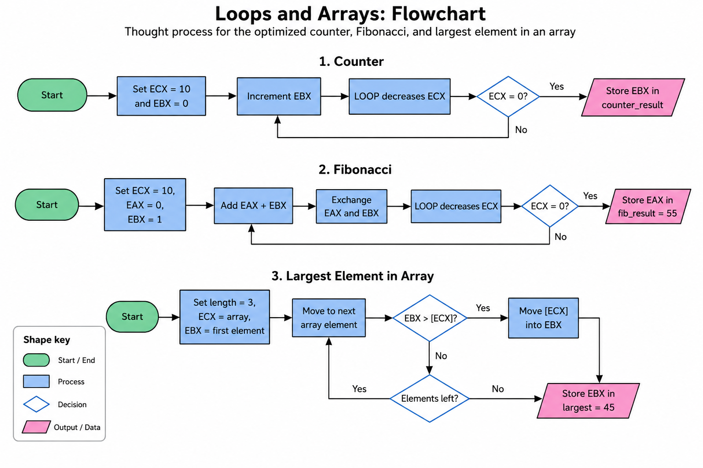

# loops-and-arrays

## Objective

Use loops and arrays in NASM Assembly to complete three tasks.

## Flowchart



## Counter

The optimized counter uses `ECX` with the `LOOP` instruction. `ECX` begins at 10 and automatically decreases by 1 each time `LOOP` executes. `EBX` begins at 0 and increases during every iteration.

```text
counter_result = 10
```

### Findings

While stepping through the code in GDB, `EBX` increases from 0 to 10 while `ECX` decreases from 10 to 0. The loop stops when `ECX` reaches 0.

## Fibonacci

The program begins with `EAX = 0` and `EBX = 1`. It performs 10 loop iterations using `ECX`. After the tenth iteration, the final value stored in `EAX` is 55.

```text
fib_result = 55
```

## Integer Array

The array contains three initialized integers:

```text
12, 45, 30
```

The program uses `ECX` to hold the array address. Since each `DD` element occupies 4 bytes, the program adds 4 to `ECX` to move to the next element.

```text
largest = 45
```

## Challenges

The main challenge was using the registers for different purposes without losing a result. Each answer is stored in memory before the registers are reused. Another challenge was moving through the array correctly by adding 4 bytes for each integer.

## Compile and Debug

```bash
nasm -f elf32 -g -F dwarf loops_and_arrays.asm
ld -m elf_i386 -o loops_and_arrays loops_and_arrays.o
gdb loops_and_arrays
```

```gdb
layout asm
layout regs
watch (int) counter_result
watch (int) fib_result
watch (int) largest
break _start
run
stepi
```

To view the array in GDB:

```gdb
x/3dw &array
```
